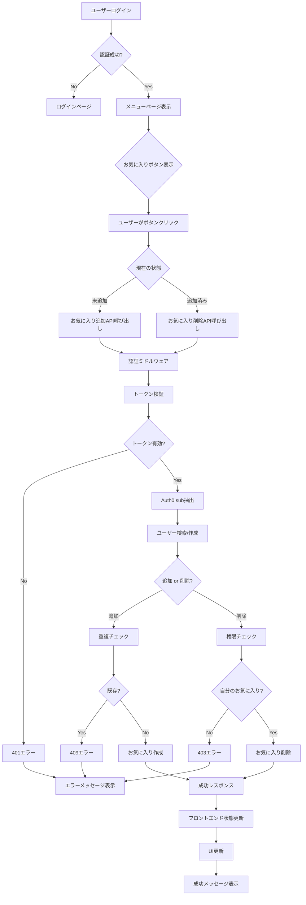

# アクティビティ図 - お気に入り機能全体フロー

```mermaid
flowchart TD
    A[ユーザーログイン] --> B{認証成功?}
    B -->|No| C[ログインページ]
    B -->|Yes| D[メニューページ表示]

    D --> E{お気に入りボタン表示}
    E --> F[ユーザーがボタンクリック]

    F --> G{現在の状態}
    G -->|未追加| H[お気に入り追加API呼び出し]
    G -->|追加済み| I[お気に入り削除API呼び出し]

    H --> J[認証ミドルウェア]
    I --> J

    J --> K[トークン検証]
    K --> L{トークン有効?}
    L -->|No| M[401エラー]
    L -->|Yes| N[Auth0 sub抽出]

    N --> O[ユーザー検索/作成]
    O --> P{追加 or 削除?}

    P -->|追加| Q[重複チェック]
    Q --> R{既存?}
    R -->|Yes| S[409エラー]
    R -->|No| T[お気に入り作成]

    P -->|削除| U[権限チェック]
    U --> V{自分のお気に入り?}
    V -->|No| W[403エラー]
    V -->|Yes| X[お気に入り削除]

    T --> Y[成功レスポンス]
    X --> Y
    Y --> Z[フロントエンド状態更新]
    Z --> AA[UI更新]
    AA --> AB[成功メッセージ表示]

    M --> AC[エラーメッセージ表示]
    S --> AC
    W --> AC
```
