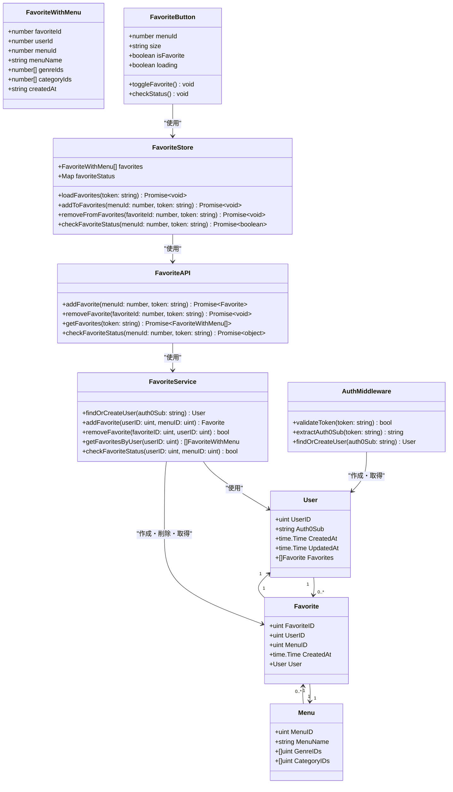

# クラス図 (Class Diagram)

```mermaid
classDiagram
    %% データベースモデル
    class User {
        +uint UserID
        +string Auth0Sub
        +time.Time CreatedAt
        +time.Time UpdatedAt
        +[]Favorite Favorites
    }

    class Favorite {
        +uint FavoriteID
        +uint UserID
        +uint MenuID
        +time.Time CreatedAt
        +User User
    }

    class Menu {
        +uint MenuID
        +string MenuName
        +[]uint GenreIDs
        +[]uint CategoryIDs
    }

    %% フロントエンドインターフェース
    class FavoriteWithMenu {
        +number favoriteId
        +number userId
        +number menuId
        +string menuName
        +number[] genreIds
        +number[] categoryIds
        +string createdAt
    }

    %% API層
    class FavoriteAPI {
        +addFavorite(menuId: number, token: string) Promise~Favorite~
        +removeFavorite(favoriteId: number, token: string) Promise~void~
        +getFavorites(token: string) Promise~FavoriteWithMenu[]~
        +checkFavoriteStatus(menuId: number, token: string) Promise~object~
    }

    %% サービス層
    class FavoriteService {
        +findOrCreateUser(auth0Sub: string) User
        +addFavorite(userID: uint, menuID: uint) Favorite
        +removeFavorite(favoriteID: uint, userID: uint) bool
        +getFavoritesByUser(userID: uint) []FavoriteWithMenu
        +checkFavoriteStatus(userID: uint, menuID: uint) bool
    }

    %% フロントエンドコンポーネント
    class FavoriteButton {
        +number menuId
        +string size
        +boolean isFavorite
        +boolean loading
        +toggleFavorite() void
        +checkStatus() void
    }

    class FavoriteStore {
        +FavoriteWithMenu[] favorites
        +Map favoriteStatus
        +loadFavorites(token: string) Promise~void~
        +addToFavorites(menuId: number, token: string) Promise~void~
        +removeFromFavorites(favoriteId: number, token: string) Promise~void~
        +checkFavoriteStatus(menuId: number, token: string) Promise~boolean~
    }

    %% 認証
    class AuthMiddleware {
        +validateToken(token: string) bool
        +extractAuth0Sub(token: string) string
        +findOrCreateUser(auth0Sub: string) User
    }

    %% リレーション（多重度で表現）
    User "1" --> "0..*" Favorite
    Menu "1" --> "0..*" Favorite
    Favorite "1" --> "1" User
    Favorite "1" --> "1" Menu

    FavoriteAPI --> FavoriteService : "使用"
    FavoriteButton --> FavoriteStore : "使用"
    FavoriteStore --> FavoriteAPI : "使用"
    AuthMiddleware --> User : "作成・取得"
    FavoriteService --> User : "使用"
    FavoriteService --> Favorite : "作成・削除・取得"
```
