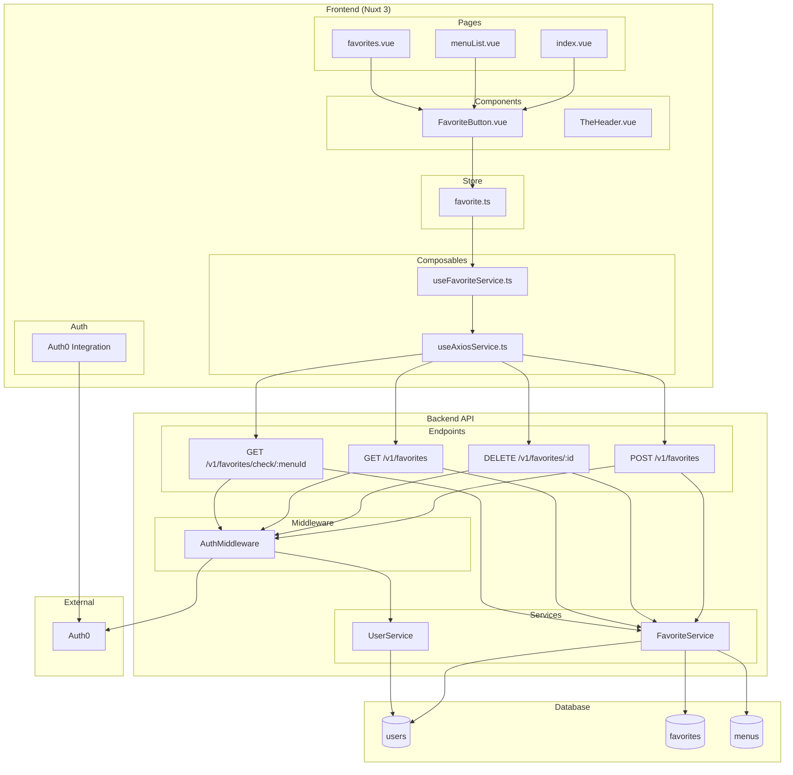

# コンポーネント図 - ユーザーお気に入り機能

```mermaid
graph TB
    subgraph "Frontend (Nuxt 3)"
        subgraph "Pages"
            P1[index.vue]
            P2[menuList.vue]
            P3[favorites.vue]
        end

        subgraph "Components"
            C1[FavoriteButton.vue]
            C2[TheHeader.vue]
        end

        subgraph "Composables"
            CO1[useFavoriteService.ts]
            CO2[useAxiosService.ts]
        end

        subgraph "Store"
            S1[favorite.ts]
        end

        subgraph "Auth"
            A1[Auth0 Integration]
        end
    end

    subgraph "Backend API"
        subgraph "Middleware"
            M1[AuthMiddleware]
        end

        subgraph "Endpoints"
            E1[POST /v1/favorites]
            E2[DELETE /v1/favorites/:id]
            E3[GET /v1/favorites]
            E4[GET /v1/favorites/check/:menuId]
        end

        subgraph "Services"
            SV1[FavoriteService]
            SV2[UserService]
        end
    end

    subgraph "Database"
        DB1[(users)]
        DB2[(favorites)]
        DB3[(menus)]
    end

    subgraph "External"
        EX1[Auth0]
    end

    %% 接続関係
    P1 --> C1
    P2 --> C1
    P3 --> C1
    C1 --> S1
    S1 --> CO1
    CO1 --> CO2
    CO2 --> E1
    CO2 --> E2
    CO2 --> E3
    CO2 --> E4

    E1 --> M1
    E2 --> M1
    E3 --> M1
    E4 --> M1

    M1 --> SV2
    E1 --> SV1
    E2 --> SV1
    E3 --> SV1
    E4 --> SV1

    SV1 --> DB1
    SV1 --> DB2
    SV1 --> DB3
    SV2 --> DB1

    A1 --> EX1
    M1 --> EX1
```
