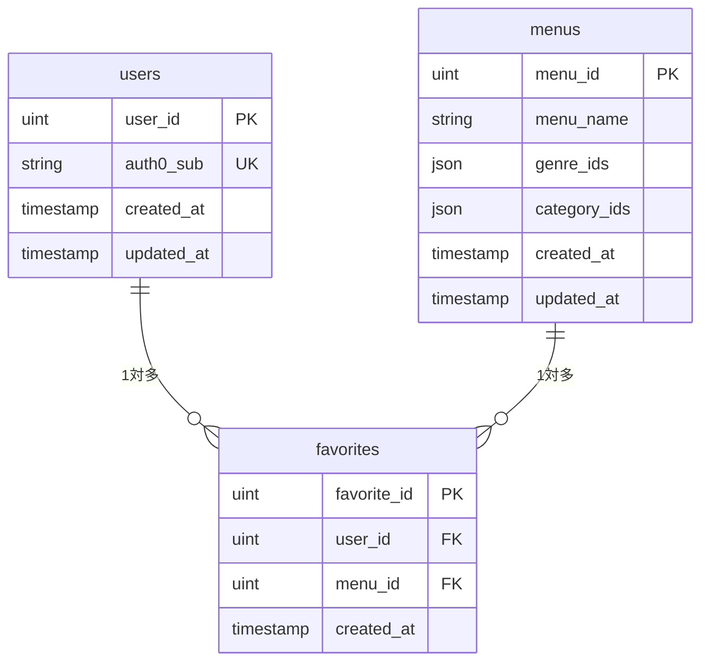

# ER図 - ユーザーお気に入り機能

```mermaid
erDiagram
    users {
        uint user_id PK
        string auth0_sub UK
        timestamp created_at
        timestamp updated_at
    }

    favorites {
        uint favorite_id PK
        uint user_id FK
        uint menu_id FK
        timestamp created_at
    }

    menus {
        uint menu_id PK
        string menu_name
        json genre_ids
        json category_ids
        timestamp created_at
        timestamp updated_at
    }

    users ||--o{ favorites : "1対多"
    menus ||--o{ favorites : "1対多"
```
