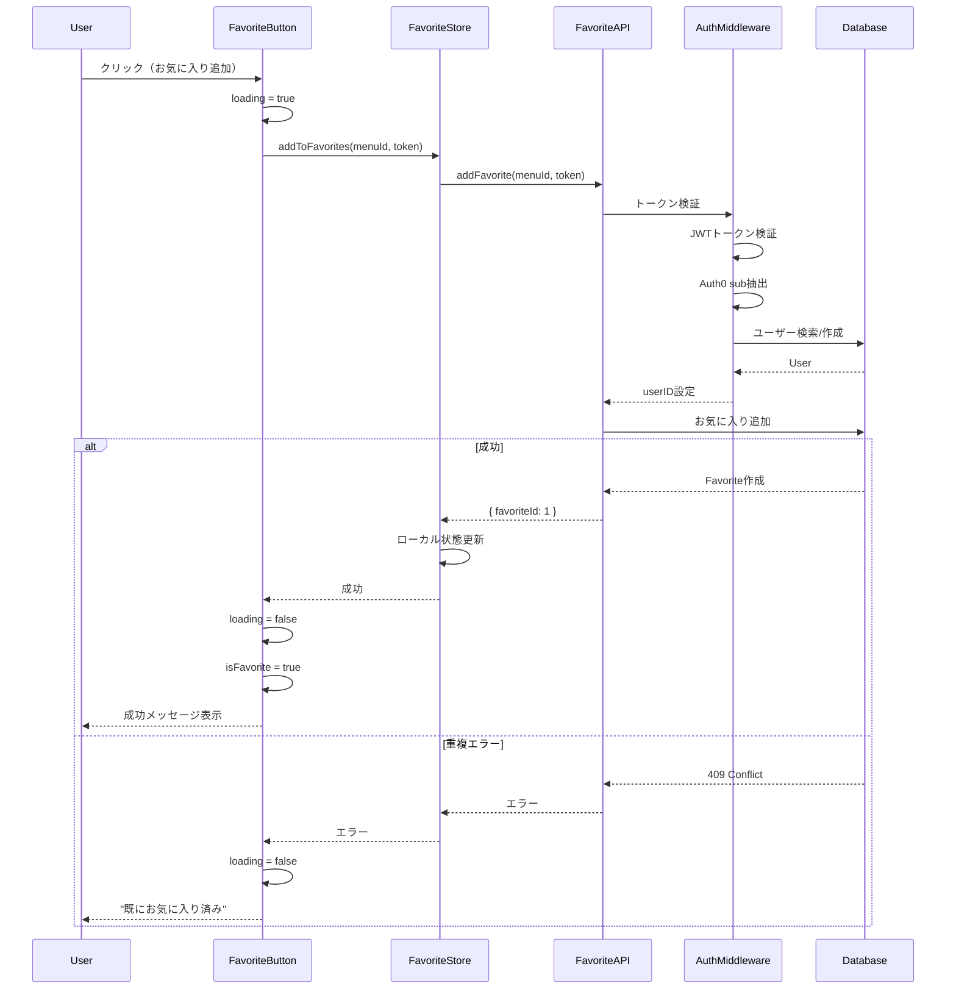
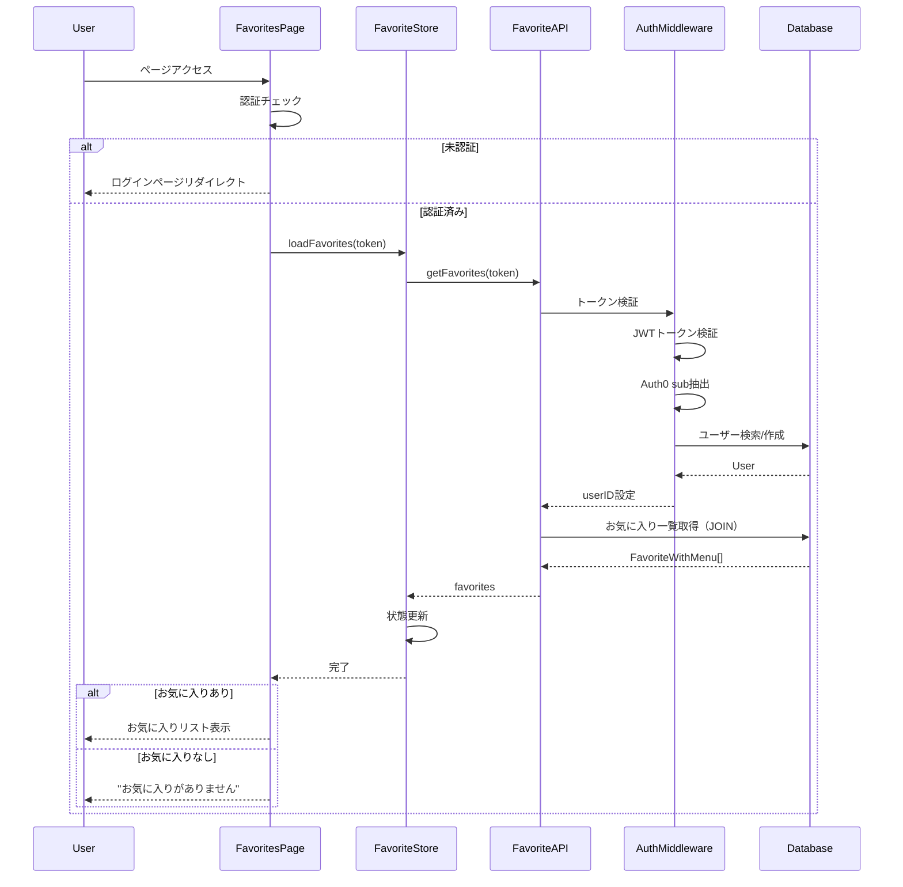

# シーケンス図 - お気に入り追加フロー

```mermaid
sequenceDiagram
    participant U as User
    participant FB as FavoriteButton
    participant FS as FavoriteStore
    participant API as FavoriteAPI
    participant AM as AuthMiddleware
    participant DB as Database

    U->>FB: クリック（お気に入り追加）
    FB->>FB: loading = true
    FB->>FS: addToFavorites(menuId, token)
    FS->>API: addFavorite(menuId, token)

    API->>AM: トークン検証
    AM->>AM: JWTトークン検証
    AM->>AM: Auth0 sub抽出
    AM->>DB: ユーザー検索/作成
    DB-->>AM: User
    AM-->>API: userID設定

    API->>DB: お気に入り追加
    alt 成功
        DB-->>API: Favorite作成
        API-->>FS: { favoriteId: 1 }
        FS->>FS: ローカル状態更新
        FS-->>FB: 成功
        FB->>FB: loading = false
        FB->>FB: isFavorite = true
        FB-->>U: 成功メッセージ表示
    else 重複エラー
        DB-->>API: 409 Conflict
        API-->>FS: エラー
        FS-->>FB: エラー
        FB->>FB: loading = false
        FB-->>U: "既にお気に入り済み"
    end
```

# シーケンス図 - お気に入りページ表示フロー

```mermaid
sequenceDiagram
    participant U as User
    participant FP as FavoritesPage
    participant FS as FavoriteStore
    participant API as FavoriteAPI
    participant AM as AuthMiddleware
    participant DB as Database

    U->>FP: ページアクセス
    FP->>FP: 認証チェック
    alt 未認証
        FP-->>U: ログインページリダイレクト
    else 認証済み
        FP->>FS: loadFavorites(token)
        FS->>API: getFavorites(token)

        API->>AM: トークン検証
        AM->>AM: JWTトークン検証
        AM->>AM: Auth0 sub抽出
        AM->>DB: ユーザー検索/作成
        DB-->>AM: User
        AM-->>API: userID設定

        API->>DB: お気に入り一覧取得（JOIN）
        DB-->>API: FavoriteWithMenu[]
        API-->>FS: favorites
        FS->>FS: 状態更新
        FS-->>FP: 完了

        alt お気に入りあり
            FP-->>U: お気に入りリスト表示
        else お気に入りなし
            FP-->>U: "お気に入りがありません"
        end
    end
```