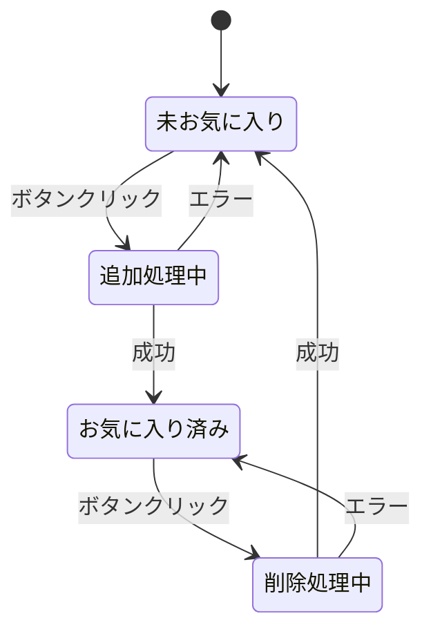
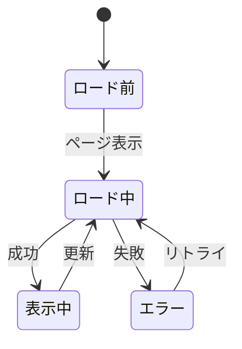

# 状態遷移図 - お気に入りボタン

```mermaid
stateDiagram-v2
    [*] --> 未お気に入り
    未お気に入り --> 追加処理中 : ボタンクリック
    追加処理中 --> お気に入り済み : 成功
    追加処理中 --> 未お気に入り : エラー
    お気に入り済み --> 削除処理中 : ボタンクリック
    削除処理中 --> 未お気に入り : 成功
    削除処理中 --> お気に入り済み : エラー
```

# 状態遷移図 - お気に入り一覧ページ

```mermaid
stateDiagram-v2
    [*] --> ロード前
    ロード前 --> ロード中 : ページ表示
    ロード中 --> 表示中 : 成功
    ロード中 --> エラー : 失敗
    表示中 --> ロード中 : 更新
    エラー --> ロード中 : リトライ
```
